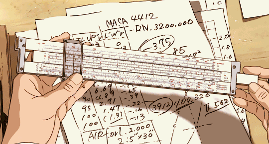

# 2장 : 전자 회로의 조합 논리

> 대부분의 기술은 **다른 목적을 위해 만들어진 기술을 계산에** `적용`했을 뿐이다.&#x20;

1장에서는 현대 컴퓨터들이 `비트`라고 부르는 **2진 상자를 내부 언어로 사용한다는 사실**을 배웠다. 2장에서는 비트를 사용하지 않는 초기 계산 장치를 살펴봄으로써 <mark style="color:red;">**왜 비트가 오늘날 사용하는 기술에 어울리는 선택인지 배우게 된다.**</mark>


비트는 <mark style="color:red;">계산에 유용한 형태로 자연스럽게 발견된 것이 아니다.</mark> 따라서 비트를 만들기 위해 무엇이 필요한지 알아보자.


1장이 추상적인 내용이었다면, 2장부터는 본론으로 들어간다.

**하드웨어**

비트에 동작하는 장치를 포함한 모든 물리적인 장치로 `조합 논리`를 구현하는 하드웨어를 살펴보자

> 조합논리는 1장에서 설명한 불리언 대수를 부르는 또 다른 이름이다.

## 1. 디지털 컴퓨터의 사례 : **톱니바퀴와 계산 장치의 역사**

> &#x20;**사람들이 숫자를 더 쉽게 계산하기 위해 어떤 도구를 개발했는지** 살펴볼자.

#### **1) 톱니바퀴를 활용한 계산 장치**

톱니바퀴는 기계식 계산기의 핵심 요소였어. <mark style="color:red;">톱니의 크기와 개수에 따라 회전 속도를 조절할 수 있기 때문에 곱셈, 나눗셈 같은 연산을 수행하는 데 유용했지.</mark>

#### **(1) 안티키테라 기계 (기원전 100년경)**

<figure><figcaption></figcaption></figure>

* **무엇인가?**\
  기원전 100년경 그리스에서 만들어진 **세계에서 가장 오래된 기계식 계산기**야.
* **무엇을 할 수 있었나?**\
  사용자가 **다이얼을 돌려 날짜를 입력**하면, 크랭크를 돌려 **해당 날짜의 태양과 달의 위치를 계산**할 수 있었어.
* **왜 중요한가?**\
  현대의 기계식 계산기의 **초기 형태**로 볼 수 있어. 특히 천문학 계산을 기계적으로 수행할 수 있다는 점에서 매우 혁신적이었어.

📌 **읽어보기 좋은 자료**

* [안티키테라 기계 설명 - Wikipedia](https://ko.wikipedia.org/wiki/%EC%95%88%ED%8B%B0%ED%82%A4%ED%85%8C%EB%9D%BC_%EA%B8%B0%EA%B3%84) : 안티키테라 기계의 구조, 사용 목적, 발굴 과정을 설명하는 자료야. 이 기계가 천문학 계산을 어떻게 수행했는지, 발견 이후 어떤 연구가 이루어졌는지 다뤄. 기계식 계산기의 초기 형태를 이해하는 데 도움 된다.

#### **(2) 화기 제어 컴퓨터 (2차 세계대전 즈음)**

<figure><figcaption></figcaption></figure>

* **무엇인가?**\
  **2차 세계대전 때 사용된 군사용 계산 장치**로, 복잡한 톱니바퀴 구조를 가지고 있었어.
* **무엇을 할 수 있었나?**\
  **삼각함수와 미적분을 계산**해서 **포탄 발사 각도나 속도** 같은 것을 자동으로 조정하는 역할을 했어.
* **왜 중요한가?**\
  기계식 컴퓨터가 군사적인 목적으로도 활용될 수 있다는 점을 보여준 예시야.

#### **2) 톱니바퀴 없이 계산하는 방법: 계산자(Slide Rule)**

톱니바퀴 없이도 계산을 쉽게 할 수 있는 도구가 있었어. **대표적인 게 계산자(Slide Rule)야.**

#### **(1) 계산자란 무엇인가?**

<figure><figcaption></figcaption></figure>

* 17세기 윌리엄 오트레드(William Oughtred)가 개발한 **기계식 계산 도구**야.
* 숫자를 곱할 때 **로그(logarithm, 로그) 개념**을 이용해서 **곱셈을 덧셈으로 바꿔서** 계산할 수 있었어.

#### **(2) 계산자의 원리**

* 로그(logarithm)를 이용하면 **곱셈을 덧셈으로 변환할 수 있어.**
  * 예를 들어,\
    **log(1.5 × 3) = log(1.5) + log(3)**\
    → 계산자가 이걸 자동으로 계산해줌!
* **즉, 숫자를 직접 곱하는 것이 아니라 로그 값을 더해서 빠르게 곱셈을 할 수 있도록 해주는 도구**
* 최초로 대량 생산된 계산 장치로 여겨지며, 사람들이 **자신이 사용할 수 있는 기술을 최대한 활용해 문제를 어떻게 해결하는지 보여주는 예시**

> 👉 **한 마디로, "숫자 곱하기"를 "더하기"로 바꿔서 계산을 쉽게 만들어 준 장치야!**

📌 **응용 예시**

* 예를 들어, 빛의 속도(3×10⁸ m/s) × 15000초 동안 간 거리를 계산할 때,
  * 로그를 사용하면 **log(1.5) + log(3) + 4 + 8 = log(4.5) + 12**
  * 계산자가 이를 빠르게 처리해줘!

#### **3) 숫자를 세는 다양한 방식들**

기계식 계산기가 나오기 전에도 사람들은 숫자를 기록하고 계산하는 다양한 방법을 사용했어.

* **탤리 막대 (Tally Stick)**:\
  기원전 18,000년부터 사용된 **숫자를 기록하는 원시적인 방법**으로, 나무나 뼈에 선을 긋는 방식이야.
* **호루스의 눈 (Eye of Horus Theory)**:\
  이집트에서 2진 분수를 표현하는 데 사용되었다는 이론이 있어.

📌 **읽어보기 좋은 자료**

* [탤리 막대의 역사 (Math History)](https://www.historyofinformation.com/detail.php?id=4556) **:** 숫자를 기록하는 **초기 방법과 그 발전 과정**을 알 수 있어.

#### **4) 차분 기관 (Difference Engine) - 기계식 컴퓨터의 시작**

<figure><figcaption></figcaption></figure>

* **무엇인가?**\
  찰스 배비지 (Charles Babbage, 1791\~1871)가 설계한 **초기 기계식 컴퓨터**야.&#x20;
* **무엇을 할 수 있었나?**\
  **10진수 계산을 자동으로 수행**하려고 했지만, **당시 기술로는 너무 정밀한 부품을 만들 수 없어서 완성되지 못했어.**
* **왜 중요한가?**\
  이후 **현대 컴퓨터 개념의 기초**를 마련하는 중요한 역할을 했어.
* 영국 정보를 설득해 복잡한 10진 기계식 계산기 개발 비용을 지원하게 했다.

📌 **읽어보기 좋은 자료**

* [찰스 배비지와 차분 기관 (Computer History Museum)](https://www.computerhistory.org/babbage/) : 차분 기관의 **구조, 원리, 컴퓨터 역사에서의 역할**을 설명하고 있다.

#### **정리: 기계적 계산기의 발전 과정**

1. **톱니바퀴 계산기** → 안티키테라 기계, 화기 제어 컴퓨터
2. **톱니바퀴 없는 계산기** → 계산자(Slide Rule)
3. **숫자 기록법** → 탤리 막대, 호루스의 눈
4. **배비지의 차분 기관** → 최초의 기계식 컴퓨터 개념&#x20;

📌 **추가로 알아두면 좋은 개념**

* **로그(Logarithm)**: 곱셈을 덧셈으로 변환하는 수학 개념.
* **과학적 표기법 (Scientific Notation)**: 큰 수를 다루기 쉽게 표기하는 방식.
* **기계식 계산기에서 전자식 컴퓨터로의 변화**: 이후 컴퓨터로 발전하는 과정.

***

### 1️⃣ 아날로그와 디지털의 차이

계산자와 비교할 때 탤리 막내나 뎃셈 기계는 중요한 차이가 있다.

<figure><figcaption></figcaption></figure>

컴퓨터의 연산 방식에는 **아날로그(analog)**&#xC640; **디지털(digital)** 방식이 있어. 이 두 가지 개념을 이해하려면 **연속적인 것과 이산적인 것**의 차이를 아는 게 중요하다.&#x20;

#### **1) 연속적인 수와 이산적인 수**

**(1) 계산자 vs. 손가락**

* **계산자**: 1.1, 1.2 같은 **소수(실수)를 표현할 수 있는 연속적인 도구**.
* **손가락**: 1, 2, 3 같은 **정수만 표현할 수 있는 이산적인 도구**.

👉 **연속적인 값**을 표현할 수 있는 계산자와 달리, 손가락으로는 1.1 같은 값을 표현하기 어렵다는 점에서 차이가 생겨.

#### **(2) 연속적(Continuous) vs. 이산적(Discrete)**

* **연속적 (Continuous)**: 숫자들 사이에 무한한 값이 존재함 → **아날로그**
* **이산적 (Discrete)**: 특정한 값만 존재하고 그 사이에 값이 없음 → **디지털**

> **예시**
>
> * **아날로그(연속적)**: 온도계(섭씨 25.3도, 25.31도 등 무한한 값)
> * **디지털(이산적)**: 손가락 개수(1개, 2개, 3개… 중간 값 없음)

#### **2) 디지털(Digital)이라는 단어의 의미**


디지털(digital)이라는 단어는 라틴어 **"digitus"**(손가락)에서 유래했어.\
→ 손가락처럼 **이산적인 값을 가지는 것**이 바로 디지털 방식이야.


👉 그래서 **디지털 컴퓨터는 숫자를 개별적인 단위(0과 1)로 다루고, 아날로그 컴퓨터는 연속적인 값을 처리할 수 있어.**

📌 **흥미로운 사실**:\
**아날로그 컴퓨터**도 실제로 존재했어! 계산자(Slide Rule)처럼 **연속적인 값을 활용하는 기계**가 대표적인 예야.

#### **3) 아날로그 방식의 한계: 정밀도의 문제**

**아날로그 방식은 실수를 표현할 수 있지만, 정밀도가 한계가 있어.**

* **예시**: 계산자에서 1.1을 선택하는 건 쉽지만, 9.1을 정확히 선택하는 건 어려워.
* 이유는 **눈금 간격이 숫자에 따라 다르기 때문**이야.

👉 만약 **아날로그 방식의 컴퓨터를 더 정밀하게 만들려면 눈금을 더 촘촘하게 배치해야 하는데, 그러면 기기가 커지고 다루기 어려워지는 문제**가 생겨.

> **극단적인 예**\
> 축구장 크기의 자를 만들면 정밀하게 측정할 수 있겠지만,\
> 이동식 컴퓨터로 사용하기엔 너무 커서 현실적으로 불가능해.


**아날로그 신호**는 무한한 정밀도(원자 단위)를 가질 수 있지만 잡음에 민감하고 변환 과정에서 왜곡이 발생할 수 있다.\
반면, **디지털 신호**는 이산적인 값이기 때문에 정밀도가 제한되지만 잡음에 대한 내성이 높고 저장과 전달에 용이하다.


***

### 2️⃣ 하드웨어에서 크기가 중요한 이유

#### **1) 컴퓨터 속도와 크기의 관계**

컴퓨터의 성능은 **전자가 얼마나 빠르게 이동할 수 있는가**에 의해 결정돼.&#x20;

> 전자는 빛의 속도(초당 3억 미터)로 이동하지만, 현실적으로는 **부품 간 거리**가 전자의 이동 속도를 제한해.&#x20;

이를 줄이기 위해 **컴퓨터 부품을 가능한 한 가깝게 배치하는 것**이 중요해.

#### **2) 컴퓨터 속도와 거리의 관계**

* 현대 컴퓨터의 `클록 속도(clock speed)`는 **4GHz(40억 Hz)** 정도야.
* 1초에 40억 개의 연산을 수행할 수 있다는 뜻이고, 40억 분의 1초 동안 전자는 **약 75mm**밖에 이동하지 못해.
* 최신 CPU의 크기는 약 **18mm** 정도라서, **전자가 40억 분의 1초 동안 CPU 안을&#x20;**<mark style="color:red;">**겨우 두 번 왕복**</mark>**할 수 있는 거리**야.

👉 **즉, 전자가 이동하는 거리가 줄어들수록 연산 속도가 더 빨라지고, 성능이 높아져!**

#### **3) 작은 하드웨어의 장점**

* **에너지 절약**: 이동 거리가 줄어들면 **소모되는 에너지도 감소**해.
* **발열 감소**: 발열이 줄어들면, **배터리 사용 시간이 늘어나고, 과열 문제도 해결**돼.
* **휴대성이 증가**: 작고 효율적인 부품 덕분에 **스마트폰이나 노트북처럼 작고 강력한 기기**가 가능해졌어.

👉 **그래서 하드웨어는 점점 더 작아지는 방향으로 발전해 왔어.**

#### **4) 너무 작아지면서 생긴 문제들**

* **발열 문제**: 작은 크기에서도 강력한 성능을 내다 보니 **열이 집중적으로 발생**하게 돼.
* **양자 효과**: 부품이 너무 작아지면 **양자역학적인 현상**이 나타나서 기존 반도체 기술로 해결하기 어려운 문제가 생겨.
* **전력 누수**: 트랜지스터가 너무 작아지면 전류가 새어나가는 문제(누설 전류)가 발생할 수 있어.


**결론**: 컴퓨터 성능을 높이려면 하드웨어 크기를 줄이는 것이 필수적이지만, 너무 작아지면 새로운 물리적 한계에 부딪힌다!


***

### 3️⃣ CPU에 대해 간단하게 알아보자

CPU(Central Processing Unit, 중앙처리장치)는 컴퓨터에서 데이터를 처리하는 핵심 장치로, **기억, 해석, 연산, 제어**라는 네 가지 주요 기능을 수행해.

<figure><figcaption></figcaption></figure>

#### **1) CPU의 구성 요소**

1. **코어(Core)**

<figure><figcaption></figcaption></figure>

* CPU 내부에서 **연산을 수행하는 핵심 단위**야.
* `싱글코어(single-core)`는 한 번에 하나의 작업만 가능하지만, **멀티코어(multi-core)**&#xB294; 여러 작업을 동시에 처리할 수 있어.
* 코어 수가 많을수록 **병렬 연산 성능**이 향상돼.

2. **쓰레드(Thread)**

* 코어는 물리적인 개념이지만, **쓰레드는 논리적인 개념**이야.
* **하이퍼쓰레딩(Hyper-Threading)** 기술을 사용하면 하나의 코어를 논리적으로 나누어 **한 코어에서 두 개의 작업을 동시에 수행할 수 있어.**
* 예를 들어, **쿼드코어(4코어) CPU에서 하이퍼쓰레딩이 적용되면 8개의 쓰레드가 실행 가능해.**

3. **클럭 속도(Clock Speed)**

* CPU가 **1초에 처리할 수 있는 연산 수**를 나타내며, 단위는 \*\*GHz(기가헤르츠)\*\*를 사용해.
* 클럭 속도가 높을수록 **연산 속도가 빠르지만, 발열과 전력 소모가 증가**해.
* **오버클럭(Overclock)**: 기본 클럭보다 높은 속도로 동작하도록 설정하는 것.

4. **캐시 메모리(Cache Memory)**

* CPU와 RAM 사이의 속도 차이를 줄이기 위해 **자주 사용하는 데이터를 빠르게 저장하는 고속 메모리**야.
* **L1 캐시**: 코어 내부에 위치하며 가장 빠르지만 용량이 작아.
* **L2 캐시**: L1보다 속도는 느리지만, 더 많은 데이터를 저장 가능해.
* **L3 캐시**: 여러 코어가 공유하는 캐시로, L1·L2보다 크지만 속도는 다소 낮아.

#### **2) CPU의 종류와 차이점**

1. **CPU vs. 프로세서(Processor)**
   * 프로세서(Processor)는 **명령어를 처리하는 모든 장치**를 의미하는 포괄적인 용어야.
   * CPU는 일반적으로 프로세서의 대표적인 형태지만, 보조 프로세서(Coprocessor)나 GPU(Graphics Processing Unit)도 프로세서의 일종이야.
2. **CPU vs. MPU vs. MCU**
   * **MPU(Microprocessor Unit)**: 일반적인 컴퓨터와 워크스테이션에서 사용하는 CPU.
   * **MCU(Microcontroller Unit)**: 작은 용량의 메모리와 입출력 장치를 단일 칩에 내장한 프로세서로, **아두이노(Arduino) 같은 임베디드 시스템에 사용**돼.

#### **3) CPU의 발전 과정과 한계**

1. **Power Wall 문제**
   * CPU의 성능을 높이기 위해 클럭 속도를 증가시키면 **발열 문제와 전력 소모 증가**가 발생해.
   * 이 문제를 해결하기 위해 **멀티코어 구조**가 등장했어.
2. **Memory Wall 문제**
   * CPU의 연산 속도(GHz)와 RAM의 속도(MHz) 차이로 인해 `병목 현상(Bottleneck)`이 발생해.
   * 이를 해결하기 위해 **캐시 메모리(Cache Memory) 구조**가 발전했어.

#### 4) CPU 다이(Die) 구조

<figure><figcaption></figcaption></figure>

* **Core (코어)**: CPU에서 연산을 수행하는 핵심 유닛. 멀티코어 CPU에서는 여러 개의 코어가 존재.
* **Shared L3 Cache (공유 L3 캐시)**: 모든 코어가 공유하는 고속 메모리로, CPU와 RAM 간 속도 차이를 줄여줌.
* **Memory Controller (메모리 컨트롤러)**: CPU와 RAM 간 데이터를 주고받는 역할을 수행.
* **Queue (대기열, 큐)**: 연산이 필요한 명령어를 정리하고 각 코어에 배분하는 역할.
* **PCIe (Peripheral Component Interconnect Express)**: GPU, SSD 등 외부 장치와 데이터를 주고받는 인터페이스.
* **Misc IO (기타 입출력 장치)**: USB, 네트워크 등 다양한 입출력 장치와 연결되는 부분.

#### 5) CPU 다이와 CPU의 차이

<figure><figcaption></figcaption></figure>

**📌 읽어보기 좋은 자료**

* [cpu에 대해 더 자세히 알아보기](https://computer.howstuffworks.com/computer-cpu-channel.htm)

***

### 4️⃣ 디지털을 사용하면 더 안정적인 장치를 만들 수 있다

#### **하드웨어의 소형화와 물리적 한계**

컴퓨터 하드웨어는 성능을 높이기 위해 계속해서 더 작아지고 있어. 하지만 너무 작아지면 **물리적인 간섭과 양자역학적인 문제**가 발생할 수 있어.

#### **1) 너무 작은 크기의 문제점**

1. **외부 간섭 문제**
   * 아주 작은 장치는 **외부 환경의 영향을 쉽게 받음**.
   * 예를 들어,  계랑컵이나 계산자는 아날로그 장치로 **우주선 방사선(cosmic ray)** 같은 작은 충격도 미세한 부품에 영향을 줄 수 있어.
   * 반면, **손가락을 이용한 셈이나 기계식 계산기 같은&#x20;**<mark style="color:red;">**이산적인 장치**</mark>**는 외부 간섭의 영향을 덜 받음**.
     * **이산적인 장치에는 판정 기준**이 있기 때문
     * 판정적 기준을 아날로그 장치에 도입하면 값 중에 어떤 범위의 값을 표현할 수 있는 가능성이 사라진다.
2. **내부 간섭 문제**
   * `전자기력(Electromagnetic Force)`은 멀리  떨어진 물체에도 영향을 미쳐.
   * **CPU 내부 선 간 거리가 몇 나노미터(10⁻⁹m) 수준**으로 작아지면서, **누화(Crosstalk, 신호 간섭)** 문제가 심각해졌어.
   * **머리카락(약 10만 나노미터)보다 훨씬 작은 간격**이기 때문에, 회로 간 신호가 서로 영향을 주는 거야.

#### **2) 신호 간섭과 디지털 회로의 필요성**

1. **전자기력과 신호 간섭(Crosstalk)**

* **전자기력은 멀리 있는 물체에도 영향을 줌**
  * 예를 들어, **라디오 신호**도 전자기파로 전송되기 때문에 멀리 있는 기기에서도 신호를 받을 수 있어.
  * 하지만 이 특성 때문에 **CPU 내부에서도 신호 간섭이 발생**할 수 있어.
* **칩 내부 전선이 매우 가까워서 간섭이 심해짐**
  * 현대 반도체 칩의 **회로 간 거리는 수 나노미터(10⁻⁹m)** 수준이야.
  * 비교하자면, **사람 머리카락 지름(10만 나노미터)보다 훨씬 작은 간격**이야.
  * 이런 작은 간격에서는 하나의 신호가 옆 전선의 신호에 영향을 주는 '`누화 효과(Crosstalk)'`가 심해져.

#### **3) 신호 간섭을 해결하는 방법**

1. **신호 간 거리를 늘리는 방법**
   * 칩 설계에서 **전선 간 거리를 멀리 배치하면 간섭을 줄일 수 있어.**
   * 하지만 이렇게 하면 **칩 크기가 커지고 성능이 저하됨**.
2. **차폐 기술(Shielding) 사용**
   * 전자파를 차단하는 **실드(Shielding) 기술**을 사용하면 간섭을 줄일 수 있어.
   * 하지만 실드를 추가하면 **전력 소모와 칩의 복잡성이 증가**하는 단점이 있어.
3. **디지털 회로의 활용**
   * **디지털 신호(0과 1)를 사용하면, 신호가 어느 정도 간섭을 받아도 판정 기준(Threshold)을 통해 원래 값을 복원할 수 있어.**
   * **디지털 신호는 잡음 내성(Noise Immunity)이 강하기 때문에, 신호 왜곡이 덜한 방식으로 설계할 수 있어.**

**4) 디지털 신호가 중요한 이유**

<figure><figcaption></figcaption></figure>

* 아날로그 신호는 연속적인 값(예: 1.1, 1.2, 1.3...)을 가지기 때문에 작은 간섭에도 큰 영향을 받아.
* 하지만 디지털 신호는 **0 또는 1만 사용하므로, 일정 수준의 간섭이 있어도 원래 신호를 유지할 수 있어.**

> 👉 **결국, 신호 간섭을 줄이고 안정적인 연산을 하기 위해 컴퓨터는 디지털 회로를 사용해!**

**📌 읽어보기 좋은 자료**

[ :전자 회로에서 발생하는 신호 간섭(누화) 문제와 이를 해결하는 방법을 설명하는 자료](https://donggreen.tistory.com/entry/%EC%A0%84%EC%9E%90-Signal-Integrity-SI-%EC%8B%A0%ED%98%B8-%EB%AC%B4%EA%B2%B0%EC%84%B1-%EB%85%B8%EC%9D%B4%EC%A6%88-%EA%B0%84%EC%84%AD-Noise-Interference%ED%83%80%EC%9D%B4%EB%B0%8D-%EC%98%A4%EB%A5%98-Timing-Errors?utm_source=chatgpt.com)

***

### 5️⃣ 아날로그 세계에서 디지털 만들기

> 아날로그 세계를 어떻게 조작해서 안정적인 계
> 산 장치를 만드는 데 필요한 디지털적 동작을 얻어낼 수 있는지 살펴보자.

<figure><figcaption></figcaption></figure>

출처 및 참고

* [컴퓨터구조-컴퓨터-구조와-기능 CPU](https://velog.io/@ckstn0777/%EC%BB%B4%ED%93%A8%ED%84%B0%EA%B5%AC%EC%A1%B0-%EC%BB%B4%ED%93%A8%ED%84%B0-%EA%B5%AC%EC%A1%B0%EC%99%80-%EA%B8%B0%EB%8A%A5-CPU)
