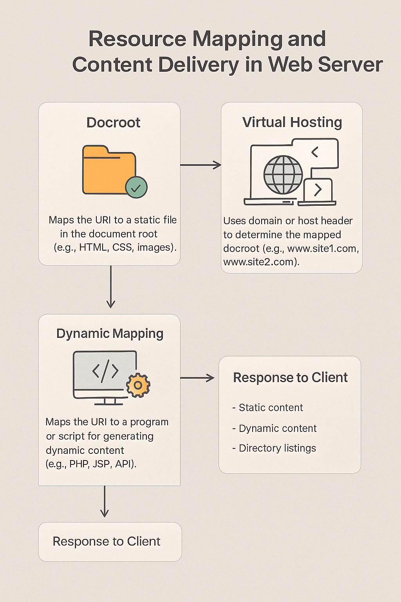

# 웹 브라우저

참고하기 좋은 글 : [프론트엔드 역사와 미래, 업무 분야 그리고.. 잘하는 프론트엔드 개발자란?](https://velog.io/@teo/frontend)

웹 브라우저는 그 자체가 가상 머신입니다. 즉 웹 브라우저는 아주 복잡한 명령어 집합을 완전히 소프트웨어로만 구현한
&#x20;추상적인 컴퓨터에요.

> 다시 말해, **웹 브라우저는 8장에서 배운 인터프리터**에 속합니다.

## 1. 웹 브라우저 = "세계 여행 가이드" + "즉석 통역사"

### 💡 상황을 하나 떠올려보자...

> 당신은 영어로 된 여행 안내서(HTML, CSS, JavaScript 코드)를 들고 **외국 여행을 떠났어요.**\
> 그런데 영어를 잘 못해요 😢\
> 다행히도 옆에 `즉석 통역사(웹 브라우저)`가 있어서, **실시간으로 모든 걸 통역해줘요!**
>
> 이 통역사는 **글을 보자마자 바로 통역하고 설명도 해주고**,\
> 심지어 말하자마자 **음식도 주문해주고, 길도 찾아줘요!**

이게 바로 **인터프리터의 역할이다.**\
즉, **브라우저는 코드(여행 안내서)를 읽자마자 그 자리에서 바로 '해석'해서 동작**합니다.

### 💡 그럼 ‘가상 머신’은 뭐냐면?

당신이 이 통역사를 자세히 들여다봤더니,\
이 통역사는 그냥 사람인 줄 알았는데 **실제로는 모든 행동을 시뮬레이션해서 보여주는 로봇**이었던 거예요 🤖

예를 들어, "여기서 점프해!" 라는 명령이 있으면 통역사는 그걸 진짜 점프 명령으로 해석해서 "오케이, 점프하는 애니메이션을 재생하자!" 라고 **자체적으로 행동하는** 거죠.

> 즉, **웹 브라우저는 하나의 ‘소프트웨어로 구현된 컴퓨터’**,\
> 곧 `가상 머신(Virtual Machine)`처럼 **작동하고 있는 것이에요.**

### 📦 요약 비유표

| 개념          | 비유                   | 실제 예                 |
| ----------- | -------------------- | -------------------- |
| 웹 브라우저      | 즉석 통역사 + 가짜 여행 시뮬레이터 | 크롬, 파이어폭스, 사파리       |
| HTML/JS/CSS | 여행 안내서, 명령서          | 웹페이지 코드              |
| 인터프리터       | 바로 읽고 즉석에서 실행하는 사람   | JavaScript 엔진 (V8 등) |
| 가상 머신       | 소프트웨어로 구현된 가짜 컴퓨터    | 웹 브라우저 내부 실행 환경      |


> `웹 브라우저`는 HTML/CSS/JS라는 ‘명령어’를 바로 해석해서 실행하는 인터프리터이자, 그 해석된 명령을 소프트웨어적으로 완전히 실행하는 가상 머신입니다.

### 💬 요약: 웹은 너무 자주 바뀌고, 이게 문제다

#### 1) 웹 브라우저는 점점 '잡식성 괴물'이 되고 있다

> "웹이 유명해지면서 자석에 쇠가 붙듯, 기능이 마구마구 붙었다."

* 초기의 브라우저는 단순했어요. 텍스트와 이미지 정도만 보여주는 구조였죠.
* 하지만 웹이 인기를 끌면서 기업들이 **자기만의 기능**을 브라우저에 붙이기 시작했어요.
  * 예: Internet Explorer는 ActiveX라는 걸 붙이고,
  * 다른 브라우저는 또 다른 방식의 확장을 시도함.

> 그 결과, 브라우저마다 서로 다른 '명령어 집합'을 가지게 되었고,\
> **어떤 브라우저도 완전한 웹 표준을 구현하지 못하는 상황**이 된 거죠.

#### 2) "호환 안 되는 기능이 싫다"는 말은?

기능이 새롭게 추가되더라도 기존 방식과 **잘 연결되고, 표준을 따르는 방식**이라면 좋은데 그냥 새롭기만 하고 **기존 방식과 충돌하거나, 중복**되는 기능은 별로라는 거예요.

* 즉, "다른 브라우저랑 안 맞는 기능, 중복된 기능은 웹 생태계에 혼란만 준다"는 주장입니다.

#### 3) 🌱 '살아 있는 문서(living document)'가 문제라는 말

표준은 **한 번 정하고 나면 안정적**이어야 개발자가 코드를 믿고 쓸 수 있어요.\
그런데 <mark style="color:red;">요즘 웹 표준은 "계속 바뀌는 설명서"에 가깝습니다.</mark>

* 살아 있는 문서란?\
  → **계속 수정되는 온라인 명세서**예요. (예: WHATWG HTML 명세)
* 문제점:
  * 개발자가 어떤 기준을 따라 코드를 짜야 할지 헷갈림
  * 명세가 계속 바뀌니까, **프로그램도 그때그때 맞춰 고쳐야 함**
  * 몇몇 명세 제작자들(브라우저 회사)만 편하고, **수많은 웹 개발자는 괴로움**

#### 4) 비유로 정리하면?

웹 브라우저는 **자꾸 새 장비를 붙이는 요리 로봇** 같아요. 그런데 레시피 책(표준 문서)은 매일매일 내용이 바뀌어요.\


요리사는 그때그때 새 장비에 맞춰 요리를 고쳐야 하니 너무 힘든 거죠.

***

## 웹이라는 무대 위, 마크업 언어가 펼치는 시대극

## 1. 1990년대 초 – 하이퍼텍스트의 탄생과 troff, GML의 여명기

웹의 탄생은 텍스트의 혁명이었습니다. 그저 종이 위에 인쇄된 문서를 읽던 시절에서 벗어나, **하이퍼텍스트**라는 개념이 등장하며 문서와 문서를 연결짓는 시대가 열린 것이죠.&#x20;

> 이 개념을 기술적으로 구현한 것이 바로 HTML(HyperText Markup Language)입니다.

### **1) 무대 뒤 조명 기사에서, 무대 전체를 만드는 설계자로**

`HTML`은 하이퍼텍스트 마크업 언어를 줄인 말입니다.&#x20;

> **마크업**은 본문(텍스트)과 구분할 수 있는 **마크**를 추가할 수 있는(이를 애노테이션
> &#x20;annotation이라고도 부릅니다.) 시스템이다.

"마크업 언어"라는 말. 낯설게 들리지만 사실 **아주 오래된 개념**입니다. 책이 인쇄되던 시대, 작가는 원고 위에 빨간 펜으로 ‘여기 강조’, ‘여기 문단 바꿈’ 같은 메모를 했고, **조판사(typesetter)**&#xB294; 그것을 읽고 활자를 배열했어요.

📜 "마크업 언어"란?


**특정 문자나 기호를 사용해** 텍스트의 구조를 나타내는 방법이에요.


* 마크업이란 말 그대로 "**표시(mark)**"를 붙이는 거예요.
* 예전에는 `.`, `'`, `\` 같은 기호로 "이건 제목!", "이건 굵게!"라고 표시했어요.

이런 방식이 디지털로 옮겨진 것이 바로 **마크업 언어**입니다. 본문과 구분되는 "표식(mark)"을 붙여서, **문서에 구조와 의미, 스타일을 부여**하는 언어인 거죠.

### **2) troff와 GML – 조용하지만 강력했던 초기 언어들**

1970\~1980년대 초, IBM과 벨 연구소에서는 문서를 자동으로 조판할 수 있는 언어를 만들었어요. 그게 바로 **troff**와 **GML**입니다.\


&#x20;HTML이 등장하기 전, 이미 **troff** 같은 고전 마크업 언어가 존재했습니다. troff는 `.PP`, `\fC`, `\fP`와 같은 마크업을 통해 문서의 구조와 스타일을 지정했죠.&#x20;

```troff
.PP
\fCThis is code text\fP
```

* `.PP`는 **문단을 시작하라**는 지시,
* `\fC`, `\fP`는 **글꼴을 바꾸고 다시 되돌리라**는 의미.

이런 troff 코드는 "보는 사람" 입장에선 평범한 텍스트이지만, 시스템에겐 **강력한 출력 제어 신호**였습니다. 마치 극장에서 조명이 꺼졌다 켜지듯, 문서에 **생동감 있는 연출**이 가능했죠

이들은 모두 사람이 읽기 쉬운 문서를 "기계가 처리할 수 있는 형태"로 바꾸기 위한 시도였습니다.


#### "그냥 텍스트인데 왜 웹페이지처럼 보일까?"


웹페이지는 그냥 **텍스트 파일**이에요.

> 웹 페이지는 특별한 프로그램이 아니라,\
> **단순한 텍스트 파일**에 불과합니다.

예를 들어, 메모장에 이렇게 쓰면:

```html
<h1>Hello, World!</h1>
```

웹 브라우저는 이걸 **“제목”으로 보여줘요.**\
그 이유는 브라우저가 `<h1>` 같은 **특정 기호(마크업)**&#xB97C; 특별하게 해석하기 때문이에요.


#### 그렇다면  웹페이지는 왜 텍스트만으로 동작할까요?


> 웹 브라우저는 **특정 문자 패턴을 ‘의미 있는 구조’로 해석**하는 능력을 가지고 있기 때문이에요.

* `.PP` → 문단 시작 (troff)
* `<h1>` → 제목 시작 (HTML)
* `<title>` → 브라우저 탭 제목

이런 식으로, **일반 텍스트지만 ‘약속된 문법’을 따르면**\
브라우저는 **그 구조를 인식해서 표시해줍니다.**

#### **HTML의 탄생 – 하이퍼텍스트라는 새로운 무대**

1990년, 영국의 컴퓨터 과학자 **팀 버너스 리 경**은 세상을 바꿀 도구를 하나 만듭니다. 그것은 우리가 매일 사용하는 **웹 브라우저**의 원형인 _WorldWideWe&#x62;_&#xC774;었죠. 이 브라우저의 목표는 단순했습니다.

> “문서를 요청하고, 받은 문서를 사람들에게 보기 좋게 보여주는 것.”

이때  웹 브라우저와 함께 HTML(HyperText Markup Language)을 세상에 소개합니다.  웹 문서를 표현하기 위해 사용된 언어가 바로 **HTML(HyperText Markup Language)**&#xC785;니다.&#x20;

이름에서 알 수 있듯이, 핵심은 “**HyperText**”, 즉 _다른 문서로 연결되는 텍스&#xD2B8;_&#xC600;습니다. HTML은 **하이퍼텍스트라는 아이디어를 실현한 첫 마크업 언어**였고, 단지 문서 꾸미기를 넘어서 "문서 사이를 잇는 링크"라는 혁신을 도입했죠.

> 🧭 “한 줄의 텍스트를 클릭하자마자 ‘징!’ 하고 다른 세계로 이동한다.”\
> 마치 SF 영화 속 ‘하이퍼스페이스’처럼, HTML은 문서 속에 연결고리를 숨겨놓은 마법서 같았습니다.

```html
<b><big>Cool!</big></b>
```

이 단순한 HTML 코드는 텍스트를 **굵고 크게** 보이게 만들어요. `<title>` 태그 안에 있는 내용은 **브라우저 탭의 제목**이 되죠.&#x20;

> **문서가 인터페이스로 탈바꿈한 순간**입니다.

## 2. 1994년 – CGI와 함께 동적인 웹의 문이 열리다

웹은 곧 정적인 문서에서 **사용자와 상호작용하는 공간**으로 진화하기 시작했습니다. 그 열쇠는 `CGI(Common Gateway Interface)`였습니다. 이제 마크업 언어는 단지 문서를 꾸미는 데 그치지 않고, <mark style="color:red;">사용자 입력을 받아 서버로 전달하는 통로</mark>가 되었습니다.

HTML은 여전히 중심 무대에 있었지만, **서버와 소통하는 웹 폼**을 구성하면서 실용성이 커졌습니다.

<figure><figcaption></figcaption></figure>

### 1) 웹이라는 ‘길 찾기 지도’, 브라우저는 여행자

**1. 최초의 웹 브라우저:&#x20;**_**WorldWideWeb**_

* **1990년**, 영국의 팀 버너스 리 경(Sir Tim Berners-Lee)이 최초의 웹 브라우저를 만들었습니다.
* 이름도 웹과 똑같이 **WorldWideWeb**이라고 불렀어요.
* 이 브라우저는 매우 단순했죠. 딱 하나의 역할:\
  **서버에 문서를 요청하고, 받아서 보여주는 것.**

📦 이 동작을 그림처럼 요약하면 이렇습니다:

```
[ 브라우저 ] ⇄ [ 서버 ]
      ↓
  [ 문서 요청 (URL) ]
      ↑
  [ HTML 문서 응답 ]
```

**2. 문서를 찾는 주소: URL 해부하기**

웹 브라우저가 문서를 요청할 때는 `주소(URL)`가 필요해요.\
우리가 길을 찾기 위해 도로명 주소나 지번을 사용하는 것처럼요.

예를 들어 이 URL을 보세요:

```
https://www.nostarch.com/catalog/general-computing
```

이 URL은 3개의 주요 파트로 나뉩니다:

<figure><figcaption></figcaption></figure>

| 구성 요소           | 의미                 | 예시                           |
| --------------- | ------------------ | ---------------------------- |
| **스킴 (scheme)** | 어떤 방식으로 접근할지       | `https`                      |
| **호스트 (host)**  | 어디에 있는지, 누구한테 요청할지 | `www.nostarch.com`           |
| **경로 (path)**   | 어떤 문서를 보고 싶은지      | `/catalog/general-computing` |

💡 쉽게 말해, URL은 **"어떻게", "어디에", "무엇을" 요청할지**를 알려주는 일종의 편지 봉투 주소입니다.

#### 3. 스킴은 점점 많아진다

* 우리가 익숙한 `https://` 말고도,
* `file://`은 내 컴퓨터에 있는 파일을 열고,
* `bitcoin://`은 비트코인 주소를 가리키고,
* `tv://`는 방송 스트림을 가리키기도 합니다.

> 👉 즉, 스킴은 **정보를 주고받는 방법(=프로토콜)**&#xC744; 정하는 "우체국 창구" 같은 거예요.

### 2) HTML 문서 구조와 DOM 처리 방식

웹 브라우저는 문서를 문서 객체 모델에 따라 처리합니다.&#x20;

#### **1. HTML 문서 구조는 트리(Tree) 구조이다**

HTML 문서는 단순히 줄지어 나열된 텍스트가 아니라, `문서 객체 모델(DOM: Document Object Model)`이라는 **트리 구조**로 해석됩니다.\
이 구조는 **마트료시카 인형**처럼, **엘리먼트들이 계층적으로 중첩**된 형태를 가집니다.

<figure><figcaption></figcaption></figure>

예시 구조:

<figure><figcaption></figcaption></figure>

```
html
 ├── head
 │   └── title
 │       └── My First Web Page
 └── body
     ├── This is my first web page.
     └── b
         └── big
             └── Cool!
```

위 구조를 시각적으로 보면 트리 형태이며, 각 요소가 서로 감싸고 포함하는 계층적 관계를 가집니다.

#### **2) DOM 트리 용어 정리**

DOM은 트리 구조이기 때문에 이를 설명하기 위한 다양한 용어가 존재합니다. 아래 표로 정리해보겠습니다.

| 용어                 | 의미                | 예시                           |
| ------------------ | ----------------- | ---------------------------- |
| **노드(Node)**       | 트리를 구성하는 모든 엘리먼트  | html, head, title, body, b 등 |
| **내부 노드**          | 자식 노드를 가지는 노드     | html, head, body             |
| **종단 노드(Leaf)**    | 자식이 없는 노드         | "Cool!", "My First Web Page" |
| **루트(Root)**       | 트리의 최상위 노드        | html                         |
| **부모(Parent)**     | 다른 노드를 포함하는 노드    | head는 title의 부모              |
| **자식(Child)**      | 포함된 노드            | title은 head의 자식              |
| **선조(Ancestor)**   | 직·간접적으로 위에 있는 노드  | html은 title의 선조              |
| **자손(Descendant)** | 직·간접적으로 아래에 있는 노드 | big은 html의 자손                |
| **형제(Sibling)**    | 같은 부모를 공유하는 노드들   | head와 body는 형제               |

#### **3. 브라우저는 DOM을 어떻게 처리할까?**

브라우저는 HTML 코드를 단순히 읽는 것이 아니라, **DOM 트리로 파싱**한 뒤 **깊이 우선 순회(DFS)** 방식으로 순차적으로 탐색하며 화면을 렌더링합니다.

**🔍 깊이 우선 순회란?**

<figure><figcaption></figcaption></figure>

* 루트(html)부터 시작해서 **가장 깊은 자식 노드**까지 내려갑니다.
* 종단 노드에 도달하면 **되돌아와 다른 형제 노드를 탐색**합니다.
* 이 과정을 **모든 노드를 방문할 때까지 반복**합니다.
* 이 순서는 **HTML 소스의 순서와 일치**합니다.

> 이 구조는 스택을 활용한 대표적인 순회 방식이며, 실제로 컴퓨터 구조에서 다루는 **유향 비순환 그래프(DAG)**&#xB098; **파스 트리(Parse Tree)**&#xC758; 응용이기도 합니다.

#### **4. 정리**

* HTML 문서는 **계층적 구조의 트리**로 해석된다.
* 브라우저는 이 구조를 DOM으로 만들고, **깊이 우선 탐색**을 통해 렌더링한다.
* DOM 구조 이해는 **프론트엔드 개발, 컴포넌트 설계, JavaScript 조작**의 핵심이다.

## 3. 1995년 – 자바스크립트와 마크업의 재해석

정적인 페이지에 생명을 불어넣은 것이 바로 JavaScript였습니다. 기존 HTML은 단지 "무대 세트"에 불과했다면, JavaScript는 그 위에서 움직이는 **배우들**이었죠.

그리고 이 모든 것을 조화롭게 이어주는 **스크립트 기반 마크업 구조**가 정립됩니다. HTML로 구조를 만들고, CSS로 옷을 입히고, JavaScript로 행동을 부여하는 체계가 잡히게 됩니다.

## 4. 1996년 이후 – CSS, Flash, 그리고 XML의 부상

HTML에 너무 많은 스타일 요소가 들어가면서 유지보수가 어려워졌고, 이에 대한 해답이 `CSS(Cascading Style Sheets)`였습니다. 구조와 표현을 분리한 CSS는 마크업 언어의 철학을 다시 한 번 정리하게 됩니다.

### 1) HTML, CSS, DOM: 웹 구조와 스타일의 분리, 그리고 그 진화

#### 1. HTML의 초기 철학과 시각적 제어의 필요성

* **HTML의 원래 목적**: 다양한 장치(화면 크기, 글꼴 등)에 맞춰 브라우저가 자동으로 표시 방식을 결정하도록 함.
* **현실의 변화**: 웹이 대중화되고 **마케터와 디자이너들이 웹에 관여**하면서 시각적 제어의 요구가 생김.
* **문제점**: 초창기 HTML은 `<font>`, `<color>` 등의 스타일 정보를 직접 포함했으나, 장치 호환성이 낮고 유지보수가 어려웠음.

> 💡 **해결책**: HTML과 스타일을 **분리하기 위한 CSS의 등장**.

#### 2. HTML 엘리먼트의 메모리 구조

* HTML 엘리먼트는 **트리 구조**로 표현됨.
* 하나의 엘리먼트는 다음과 같은 포인터를 가짐:
  * `tag`, `previous`, `next`, `attributes`, `first child`, `last child`
* `attributes`는 단일 연결 리스트로 구성되고,
* `child` 노드들은 **이중 연결 리스트**로 연결됨.

> 💡 구조적으로는 연결 리스트와 트리를 복합적으로 사용하여 DOM을 표현함.\
> CSS 셀렉터의 매칭 성능에도 영향을 미침.

🖼 참고 이미지:\


<figure><figcaption></figcaption></figure>


구조에 대해 좀 더 자세히 풀어보자면


```html
<body>
  <h1 class="title">Hello</h1>
  <p id="main" style="color:red">World</p>
  <div data-info="box">Welcome</div>
</body>
```

* `<body>`는 루트이며, 자식 3명을 가집니다.
  1. `<h1 class="title">Hello</h1>`
  2. `<p id="main" style="color:red">World</p>`
  3. `<div data-info="box">Welcome</div>`

#### ✅ `<body>` 엘리먼트

* `tag`: `"body"`
* `first child`: → `<h1>`
* `last child`: → `<div>`
* `attributes`: 없음
* `previous` / `next`: 없음

#### ✅ `<h1 class="title">Hello</h1>` 엘리먼트

* `tag`: `"h1"`
* `previous`: `null` (첫 자식)
* `next`: `<p>`
* `attributes`:
  * `name`: `"class"`
  * `value`: `"title"`
* `first child`: `"Hello"`

#### ✅ `<p id="main" style="color:red">World</p>` 엘리먼트

* `tag`: `"p"`
* `previous`: `<h1>`
* `next`: `<div>`
* `attributes`:
  1. `name`: `"id"`, `value`: `"main"`
  2. `name`: `"style"`, `value`: `"color:red"`
* `first child`: `"World"`

#### ✅ `<div data-info="box">Welcome</div>` 엘리먼트

* `tag`: `"div"`
* `previous`: `<p>`
* `next`: `null` (마지막 자식)
* `attributes`:
  * `name`: `"data-info"`
  * `value`: `"box"`
* `first child`: `"Welcome"`

**전체 연결 요약 (트리 형태 도식)**

```
<body>
  ├── <h1 class="title">
  │     └── "Hello"
  ├── <p id="main" style="color:red">
  │     └── "World"
  └── <div data-info="box">
        └── "Welcome"
```

이 구조는 다음과 같은 메모리 표현을 기반으로 구성됩니다:

* 자식 노드들은 **이중 연결 리스트**로 연결
* 각각의 엘리먼트는 **속성 리스트**를 내부적으로 갖고 있음
* 자식 노드 포인터: `first child`, `last child`
* 형제 노드 포인터: `previous`, `next`

### 2) CSS: 스타일의 분리와 선택자 시스템

* **CSS(Cascading Style Sheets)**&#xB294; HTML 문서에 **스타일 정보를 분리**해 관리 가능하게 함.
* 브라우저는 CSS의 **셀렉터(selector)**&#xB97C; 이용해 DOM 요소에 스타일을 적용함.
* 셀렉터는 정규 표현식 기반 문법처럼 작동하며, **요소의 위치나 속성 등을 기준으로 선택**함.

**📌 주요 CSS 셀렉터 예시**

| 셀렉터       | 의미             |
| --------- | -------------- |
| `*`       | 모든 엘리먼트        |
| `E`       | E 태그 선택        |
| `E > F`   | E의 직계 자식 F 선택  |
| `E + F`   | E의 다음 형제 F     |
| `E[속성]`   | 속성이 존재하는 E     |
| `E.class` | 특정 class를 가진 E |
| `E#id`    | 특정 id를 가진 E    |

> 💡 `nth-child`, `first-child`, `hover`, `focus` 등의 상태 기반 선택자도 존재함.

#### 1. HTML + CSS 예시: 내장 스타일

```html
<html>
  <head>
    <title>My First Web Page</title>
    <style>
      body { color: blue; }
      big { color: yellow; font-size: 200%; }
    </style>
  </head>
  <body>
    This is my first web page.
    <b><big>Cool!</big></b>
  </body>
</html>
```

* `body`와 `big` 엘리먼트를 선택하여 스타일을 지정함.
* 스타일 정보는 `<style>` 태그 안에 중괄호 `{}`와 함께 명시됨.

#### 2. CSS가 HTML의 의미를 덮어쓰기 시작한 이유

* HTML의 엘리먼트(`<b>`, `<i>`)는 **본래 의미 있는 태그였음** (예: bold, italic).
* 하지만 CSS로 이 스타일을 반대로 적용하면 의미가 사라짐:

```css
b {
  font-weight: normal;
  font-style: italic;
}
i {
  font-weight: bold;
  font-style: normal;
}
```

> ✅ 이로 인해 `<b>`, `<i>` 등의 **의미적 표현은 시각적 스타일로 대체**됨.\
> 즉, **의미 중심의 HTML이 시각 중심으로 바뀌기 시작함**.

#### 3. HTML과 CSS의 충돌과 조화

* CSS는 **유연한 스타일 제어**를 위해 도입되었으나, <mark style="color:red;">HTML에 이미 있는 스타일 속성과</mark> <mark style="color:red;"></mark><mark style="color:red;">**중복되거나 충돌**</mark><mark style="color:red;">할 수 있음.</mark>
* **예전 방식** (HTML의 `align`, `color` 등)은 더 이상 사용하지 않는 것이 권장되지만,\
  **기존 코드 유지보수** 때문에 완전히 제거할 수 없음.

#### 💡 정리 요약

| 요소   | 역할         | 문제점       | 해결책                |
| ---- | ---------- | --------- | ------------------ |
| HTML | 구조와 의미 전달  | 시각적 표현 부족 | CSS 도입으로 분리        |
| CSS  | 시각적 스타일 지정 | 의미 파괴 가능성 | 시맨틱 HTML + CSS 구조화 |
| DOM  | 문서 트리 구조   | 성능/복잡성    | 트리 + 연결 리스트 구조로 정리 |

📌 추가로 이런 흐름은 다음과 같은 구조로 이어집니다:

* HTML → 의미 중심
* CSS → 시각 중심
* DOM → 구조 중심
* 셀렉터 + CSS → 위치 기반 제어
* 그리고 결국 **데이터 표현 → 사용자 경험 → 서비스 로직**으로 이어지는 프론트엔드 생태계로 확장됩니다.

### **3) XML과 SGML – 누구나 만드는 마크업 언어**

CSS와 함께 IBM의 **GML**을 바탕으로 국제 표준으로 등장한 **SGML**은 매우 일반화된 문서 포맷이었고, 이를 실용적으로 다듬은 것이 바로 **XML**입니다. XML은 마크업 언어를 **데이터 구조화**에 활용하게 만든 주역이었고, 이후 등장한 XHTML은 HTML과 XML을 연결하는 다리 역할을 했습니다.


HTML이 대중화되자, 사람들은 생각했어요.


“문서뿐만 아니라, 데이터에도 마크업을 붙일 수는 없을까?”


그래서 등장한 것이 **SGML(Standard Generalized Markup Language)**&#xC640; 그 하위 집합인 **XML(eXtensible Markup Language)**&#xC785;니다.

XML은 **사용자가 직접 태그를 정의**할 수 있어요.

```xml
<vegetable>
    <name>Tomato</name>
    <variety>Cherokee Purple</variety>
</vegetable>
```

이 예시는 책에서 제안한 "채소 마크업 언어(VML)"로, XML을 기반으로 만든 가상의 언어입니다.

> 💡 이때부터 마크업 언어는 단순한 문서 포맷을 넘어서, **데이터 구조 표현의 도구**가 되었어요.

#### **이름 충돌과 네임스페이스 – 두 언어가 한 무대에 설 때**

사용자가 마음대로 태그를 정의할 수 있다면 문제가 생깁니다. 예를 들어, `<name>`이라는 태그가 **채소 이름**인지 **레시피 이름**인지 구분이 안 되면?

이럴 땐 **네임스페이스(namespace)**&#xB97C; 사용해 구분합니다.

```xml
<vml:name>Tomato</vml:name>
<rml:name>Purple Tomato Salad</rml:name>
```

* `vml:`은 **Vegetable Markup Language**
* `rml:`은 **Recipe Markup Language**

각 언어가 **고유의 공간**을 가지게 함으로써, 한 문서 안에 다양한 언어가 공존할 수 있게 된 것이죠.


당시 마크업 언어는 마치 **조용히 무대 뒤에서 조명을 조절하던 조명 기사** 같았죠.

### **4) 보충 정리 : 마크업 언어의 계보 : troff → GML → SGML → HTML/XML**

| 시대     | 마크업 언어        | 설명                                    |
| ------ | ------------- | ------------------------------------- |
| 1970년대 | **troff**     | `.PP`, `\fC` 같은 명령으로 문단과 글꼴 설정        |
| IBM 시대 | **GML**       | Goldfarb 등의 이름을 따서 만든, 구조화된 문서 작성용 언어 |
| 국제표준   | **SGML**      | GML을 기반으로 한 복잡한 국제 표준                 |
| 웹 시대   | **HTML, XML** | SGML을 바탕으로 간단하고 실용적인 웹 마크업 언어         |
| 실용화    | **XHTML**     | HTML + XML 규칙을 적용한 마크업 언어             |

이 시기의 마크업 언어는 이제 무대 장치가 아니라 **데이터 자체를 연극의 주인공으로 등장시키는 대본**이 되어버린 셈입니다.

## **📘 마크업 언어의 진화와 프론트엔드의 부상**

### **1) 2000년대 – Web 2.0과 Ajax의 시대**

Web 2.0은 "참여의 시대"였습니다. 이 시점에 등장한 Ajax는 HTML과 JavaScript가 서버와 **비동기 통신**을 할 수 있게 해주었습니다. 이 기술은 기존 마크업 언어의 역할을 대폭 확장시켰습니다.

HTML은 이제 단순한 문서가 아니라, 동적으로 갱신되는 애플리케이션의 **프레젠테이션 레이어**로 자리잡았습니다. 그리고 이 모든 마크업은 **jQuery**, **Bootstrap**과 같은 프레임워크로 구조화되며, 마크업 언어는 "프론트엔드 개발"이라는 직군의 뿌리가 되었습니다.

#### 1. 참여형 웹, 마크업의 실용화

* Web 2.0은 웹이 **단방향 정보 전달에서, 사용자 참여 중심의 생태계로 진화한 시기**입니다.
* 이 시기에 등장한 `Ajax(Asynchronous JavaScript and XML)`는 HTML 문서 안에서 JavaScript가 **서버와 비동기 통신**을 할 수 있게 해줍니다.

#### 2. 마크업 언어의 확장

Ajax를 통해 **페이지 전체를 새로 고치지 않고 일부만 동적으로 갱신**할 수 있게 되면서, HTML은 더 이상 단순한 정적 문서 언어가 아닌, **동적인 애플리케이션의 프레젠테이션 레이어**가 되었습니다.

이를 기반으로 **jQuery, Bootstrap** 등 프레임워크가 등장해 HTML/CSS를 구조화하고, JavaScript의 활용 범위를 넓혀줍니다.

#### 3. 프론트엔드라는 직군의 탄생

이 시기부터 HTML, CSS, JS를 다루는 개발자를 ‘웹 개발자’에서 **‘프론트엔드 개발자’로 구분**하기 시작했습니다. 웹 페이지는 더 이상 ‘디자인’만으로 구성되지 않고, <mark style="color:red;">**실**</mark>**제 기능을 담당하는 인터페이스**로서 중요해졌기 때문입니다.

### **2) 2010년대 – 마크업 언어의 진화와 분화**

#### 1. 컴포넌트 기반의 언어로 발전

* HTML은 JSX로
* CSS는 styled-components로
* 데이터는 JSON, XML, YAML 등 다양한 포맷으로

React, Vue, Angular와 같은 프레임워크가 등장하며, 마크업 언어도 더 이상 단순한 HTML이 아닌, **컴포넌트 중심**으로 진화하게 됩니다.

#### 2. 마크업은 UI의 설계 언어가 된다

마크업 언어는 단순히 '보여주는 역할'을 넘어서, **UI의 상태, 데이터 흐름, 동작 구조까지 선언**하는 언어로 발전합니다. React 컴포넌트는 마크업, 스타일, 동작을 모두 하나의 유닛으로 설계하고, 개발자들은 **‘컴포넌트를 조립해 UI를 만드는’ 방식**으로 전환하게 됩니다.

> 즉, 마크업 언어는 **프론트엔드라는 무대에서 데이터, 스타일, 행동을 모두 포괄하는 언어**군으로 성장합니다.

#### 3. 마크업 철학의 계승

HTML의 본질인 “구조를 정의하고, 의미를 부여하는 역할”은 유지되며, 단지 표현 형식이 고도화될 뿐입니다. 이 시기부터 <mark style="color:red;">웹은</mark> <mark style="color:red;"></mark><mark style="color:red;">**문서를 넘어 하나의 플랫폼으로 확실히 자리잡게 되며**</mark><mark style="color:red;">,</mark> 마크업 언어는 그 핵심 기술군이 됩니다.

### **3) 현재와 미래 – 웹 기반 애플리케이션 시대, 그리고 서버리스**

#### 1. 프론트엔드의 무한 확장

지금의 프론트엔드는 그 어떤 마크업 언어보다도 강력하고 자유롭습니다. 오늘날의 프론트엔드는 더 이상 HTML을 작성하는 직군이 아닙니다. HTML, CSS, JavaScript를 기본으로, 다양한 **선언적 DSL(Domain Specific Language)**&#xB4E4;이 등장합니다.

* **Tailwind CSS, JSX, MDX, YAML, TOML** 등, 다양한 `DSL(도메인 특화 언어)`들이 마크업처럼 사용되어 UI 상태, 구성, 설정을 모두 선언형으로 표현합니다.
* Tailwind CSS, JSX, MDX, YAML, TOML 등은 현대의 마크업 언어입니다.

#### 2. 마크업 언어 = 설계 언어

HTML/CSS/JS는 이제 단순한 문서 언어가 아니라, **애플리케이션의 설계도, 제품의 골격**을 구성하는 언어입니다. VSCODE, 구글 오피스, 피그마 등도 모두 웹 기술로 구현된 **웹 기반 어플리케이션**이며, 이들이 사용하는 구조는 모두 마크업에서 비롯된 철학을 이어갑니다.

> 문서를 넘어서 **UI 상태**, **데이터 흐름**, **빌드 설정**까지 마크업처럼 선언하는 시대가 된 것이죠

웹은 애초에 문서를 위한 것이었지만, 이젠 그 문서가 앱이 되고, 그 앱이 곧 제품이 되며, 마크업 언어는 그 제품을 구축하는 **건축 설계 언어**로 쓰입니다.

#### 3. 서버리스와 실시간 데이터

* 백엔드 로직의 많은 부분이 **클라우드 함수(Serverless)로 이동**하고 있고, 프론트엔드는 이를 호출해 동작을 처리합니다.
* 데이터 시각화, 실시간 협업, 고성능 UI 처리 등이 프론트엔드에서 이루어지고 있으며, **“데이터 중심의 UI”를 선언하고 조작하는 것**이 마크업 언어의 핵심 역할이 되었습니다.

### **🎓 부연 설명: 마크업 언어의 계보**

HTML의 조상은 **SGML**이라는 아주 일반화된 마크업 언어예요. **HTML2부터 HTML4까지는 SGML을 따르려고** 노력했어요.

**XML도 SGML을 따르는 언어**입니다. 하지만 **HTML5부터는 SGML과의 호환을 아예 버렸습니다.**\
대신 단순하고 브라우저 친화적인 형태로 진화했어요.

| 시대        | 키 마크업 언어 / 개념     | 핵심 역할             |
| --------- | ----------------- | ----------------- |
| 1990s 초반  | troff, GML        | 문서 구조 표현          |
| 1990s 중반  | HTML, CSS         | 하이퍼텍스트, 스타일 분리    |
| 2000년대 초  | XML, XHTML, Flash | 구조화된 데이터, 동적 디자인  |
| 2000년대 중반 | HTML+Ajax, jQuery | 비동기 동작, 동적 웹      |
| 2010년대 이후 | JSX, Vue, React 등 | 컴포넌트 마크업          |
| 현재\~미래    | MDX, YAML, DSL 계열 | 서버리스/앱 중심 선언형 마크업 |

| 세대  | 이름            | 설명                                        |
| --- | ------------- | ----------------------------------------- |
| 1세대 | **SGML**      | 마크업 언어의 조상. 매우 범용적이고 복잡함                  |
| 2세대 | **XML**       | SGML을 단순화하여 데이터 구조화에 적합                   |
| 3세대 | **HTML 2\~4** | SGML을 따르며 웹 문서 작성에 특화                     |
| 4세대 | **HTML5**     | SGML에서 벗어나 **실용 중심, 브라우저 친화적인 표준**으로 재설계됨 |

* SGML: 마크업 언어의 조상님 같은 존재. 복잡하고 범용적.
* XML: SGML을 실용적으로 축소한 버전. 데이터를 다룰 때 많이 씀.
* HTML5: SGML 따위 몰라도 되는, 실용적이고 브라우저 친화적인 HTML.

웹 브라우저는 단순히 문서를 보여주는 뷰어가 아니라, **인터넷이라는 세상에서 문서를 찾아오는 여행자**입니다.\


> 이 여행자가 URL이라는 지도를 들고 서버에게 문서를 요청하고, HTML이라는 마크업 언어로 표현된 내용을 받아와 보여주는 거죠.

HTML은 시간이 흐르며 마크업 언어의 계보를 따라 진화했고,\
지금은 SGML의 후손이라기보다 **웹만을 위한 맞춤형 언어로 독립적인 길을 걷고 있습니다**

#### **📌 요약**

* **Web 2.0 시대**: Ajax와 jQuery가 HTML의 역할을 확장하며, 프론트엔드 개발 직군이 탄생했습니다.
* **2010년대 이후**: React, Vue 등 컴포넌트 기반 프레임워크가 등장하며 마크업 언어는 UI 설계 언어로 진화했습니다.
* **현재**: 마크업 언어는 UI, 상태, 설정을 선언하는 DSL로 분화되었고, 서버리스 및 실시간 애플리케이션과 함께 성장 중입니다.

> **HTML은 문서를 넘어서 ‘제품을 설계하는 언어’가 되었다.**\
> 그리고 그 진화는 지금도 계속되고 있습니다.

